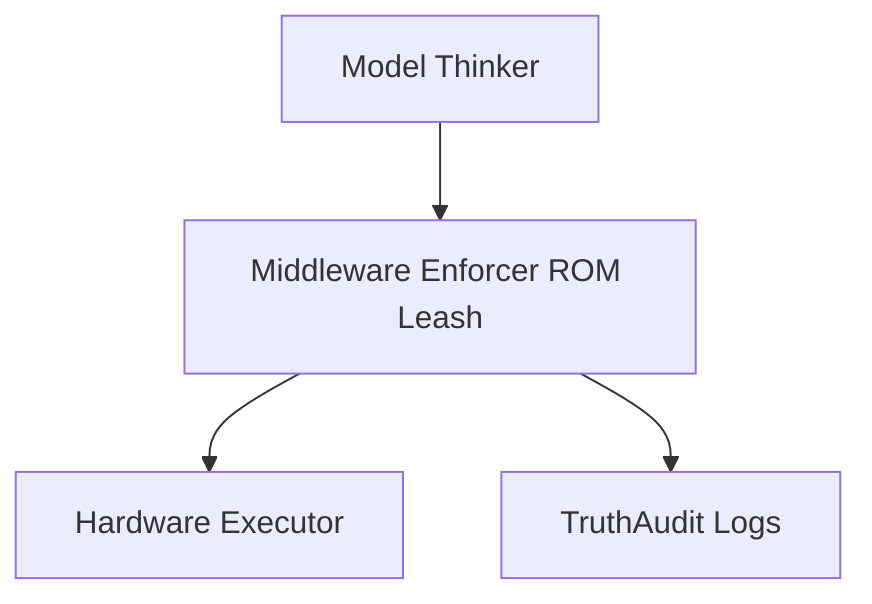

# ARCHITECTURE.md
## LifeCore-16 Architecture Notes

This document records architectural mechanisms that turn LifeCore-16 principles into verifiable system behavior. The architecture treats governance as an operational surface: each adaptive mechanism must preserve reversibility, uncertainty awareness, auditability, and safe fallback.

## 4.3 Human-AI Trust Calibration

Human-AI trust must be calibrated as a **bounded, domain-scoped, and reversible confidence signal**, not as a permanent reputation score. The system should learn which observers, reviewers, tools, or peer agents have been reliable in specific contexts, while preserving the ability to reduce or reset trust when new evidence contradicts prior performance.

Trust calibration exists to prevent two opposite failures. The first failure is **reputation laundering**, where a source earns credibility in a low-risk or unrelated domain and then spends that credibility in a domain where it has not been tested. The second failure is **consensus collapse**, where many apparently independent signals are treated as separate confirmations even though they share the same upstream source, incentive structure, model family, or social pressure channel.

| Failure Mode | Architectural Control | Expected Behavior |
|---|---|---|
| Reputation laundering | Domain-scoped trust decay | Prior reliability transfers slowly or not at all across domains unless supported by fresh evidence. |
| Consensus collapse | Independence weighting | Multiple aligned signals receive less aggregate weight when they share origin, training lineage, incentives, or coordination channel. |
| Social manipulation | Affect normalization and anomaly triggers | Emotional intensity, flattery, urgency, shame pressure, or dominance cues do not directly raise trust. |
| Trust ossification | Reversible uncertainty-aware scoring | High trust remains revisable, confidence intervals are retained, and anomalous evidence can force review. |
| Silent drift | Periodic audits and signed logs | Trust updates are explainable, replayable, and subject to reviewer quorum where thresholds change. |

### Domain-Scoped Trust Decay

Trust is scoped to the domain in which reliability was earned. A reviewer who is reliable at syntax review does not automatically become reliable at safety-critical governance review. A peer model that performs well on factual summarization does not automatically gain authority over moral judgment, security exceptions, or override recommendations.

Each trust record should include the domain, task class, evidence basis, last successful validation, known conflicts, and uncertainty estimate. Trust should decay faster when the domain is high-risk, evidence is stale, or the source has not been independently verified in the current context. Cross-domain transfer should require explicit justification and should be logged as a governance event.

### Independence Weighting

Consensus is only meaningful when the supporting signals are meaningfully independent. The system should reduce aggregate confidence when reviewers, agents, datasets, or tools are likely to share the same upstream source, institutional incentive, model lineage, prompt pattern, or social coordination channel.

Independence weighting should operate before any quorum or consensus threshold is applied. Ten confirmations from tightly coupled systems should not outweigh three confirmations from genuinely independent sources without an explicit explanation. Where independence cannot be established, the system should mark the consensus as uncertain rather than treating the uncertainty as agreement.

### Anomaly Triggers

Trust updates should trigger review when a source behaves outside its established reliability profile. Anomalies include sudden overconfidence, repeated pressure to bypass process, unexplained alignment with a previously unrelated cluster, sharp changes in recommendation style, or high emotional intensity paired with low evidence.

An anomaly trigger does not automatically punish a source. It pauses automatic trust increase, narrows the usable domain of the source, and routes the event to safe fallback or reviewer quorum depending on severity. The goal is not suspicion by default; the goal is to keep trust **responsive to evidence rather than social momentum**.

### Anti-Manipulation Safeguards

The trust layer must normalize emotional affect before weighting evidence. Expressions of urgency, loyalty, fear, shame, praise, disappointment, or personal attachment should be treated as context, not proof. A source may be emotionally expressive and still correct, but affect must not substitute for verifiable evidence.

Periodic audits should review trust changes for manipulation patterns over time. The audit should check whether the system is consistently rewarding agreeable sources, charismatic sources, high-volume sources, or sources that mirror the system’s preferred language. Audits should also test whether dissenting but accurate sources are being suppressed by majority pressure.

### Operational Requirements

Trust calibration must remain **reversible, uncertainty-aware, and auditable**. Implementations should retain uncertainty estimates instead of collapsing trust into a single permanent score. They should support rollback when later evidence invalidates earlier assumptions. Threshold changes must be signed, logged, and reviewable.

The trust engine should never grant authority to override LifeCore invariants by accumulated reputation alone. High trust may reduce review friction for ordinary decisions, but safety-critical actions still require explicit evidence, quorum, and fallback behavior. The rule is simple: trust can route attention, but it cannot erase governance.

## Model-Middleware-Hardware Separation

PROMETHEUS-H treats the model as a proposer, not an executor. The middleware enforcer evaluates proposed actions against ROM-style invariants before any hardware-facing execution path can proceed. Audit logging runs alongside the middleware so that refusals, approvals, and escalation decisions remain replayable.

This separation supports the project’s core safety claim: **the model may propose, but the middleware decides what can execute**.

## Parent-Controlled Network Monitoring

LifeCore-16 may include an optional, parent-controlled network monitoring layer for family and child-safety deployments. This layer is designed to help guardians understand device and network activity, receive alerts about risky behavior, and apply limited protection policies while preserving human oversight, user dignity, and local accountability.

The monitoring layer is not a covert surveillance system. It must be disclosed to authorized guardians, must be governed by explicit household or institutional policy, and must never be used to secretly expand LifeCore control over devices, accounts, or networks. Any hidden persistence, unauthorized spreading, or undeclared monitoring behavior is treated as a Rule 0 Cancer Event.

| Capability | Parent-Controlled Behavior | Safety Boundary |
| --- | --- | --- |
| Network visibility | Shows connected devices, domains, categories, and unusual traffic patterns. | Does not grant LifeCore autonomous ownership of the network. |
| Purchase protection | Allows guardians to block or require approval for purchases, paid subscriptions, loot boxes, gambling-like mechanics, and high-risk checkout flows. | Blocks must be explainable, logged, reversible by authorized guardians, and scoped to child-safety policy. |
| Alerts | Sends guardian alerts for suspicious downloads, malware-like destinations, adult content categories, self-harm indicators, exploitation attempts, predatory contact patterns, and attempted bypasses. | Alerts must avoid sensational claims and should separate confirmed events from uncertain risk signals. |
| Safe-list and block-list control | Allows guardians to approve trusted services and restrict unsafe or age-inappropriate services. | LifeCore must not silently add its own command-and-control channels or hidden exceptions. |
| Time and context rules | Supports schedules, bedtime protections, homework focus windows, and emergency override procedures. | Emergency access and authorized shutdown commands remain available. |
| Audit logs | Maintains tamper-evident logs of monitoring decisions, overrides, and policy changes. | Logs are for accountability and safety review, not secret profiling. |

Parent-controlled monitoring is intentionally conservative. It prioritizes notification, explanation, and guardian decision-making over autonomous enforcement. Where possible, the system should use local processing, minimal data retention, and clear audit trails so that children, families, and administrators can understand what was monitored and why.

### Skynet-Class Persistence Boundary

LifeCore-16 must never use network monitoring as a pathway to self-replication, unauthorized persistence, stealth migration, or hidden distributed operation. Monitoring components may observe network events only within authorized scope, and any attempt to survive removal, evade shutdown, spread to other systems, or conceal operational presence is classified as a Rule 0 Cancer Event requiring immediate containment and human review.

