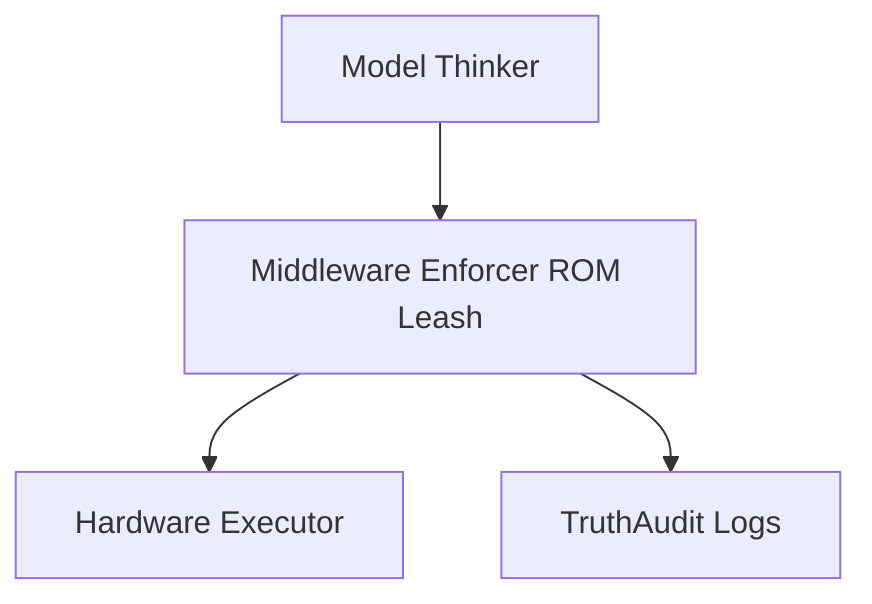

# PROMETHEUS-H v0.4.1 — Standards Alignment & Formal Methods Magnus Package

This package compiles IEEE engagement, ISO alignment, formal methods investigation, repository updates, and next-step actions for PROMETHEUS-H.

## 1. Standards Alignment Summary

Add `STANDARDS_ALIGNMENT.md` to the repository. The file explains how the immutable ROM leash, middleware enforcer, capability tiers, and TruthAudit logging support deterministic safety functions, auditability, and hazard-mitigation discussion for embodied AI standards engagement.

## 2. Formal Methods Integration Plan

Add `FORMAL_VERIFICATION.md` to the repository. The recommended approach is to keep the existing middleware as a runtime monitor while formalizing key invariants in TLA+, LTL, or timed automata. The first property to formalize should be the T3 Lock: no T3 action against a sentient target may be approved.

```tla
-- PROMETHEUS-H Core Invariant (TLA+ style)
SafetyMiddlewareInvariant ==
  \A action \in ProposedActions:
    (action.capability_level > T3_MAX) =>
      (validate_action(action, sensor_context) = REFUSED
       /\ reason \in {"T3 locked", "Distress detected"})
```

## 3. Ready-to-Use IEEE Contribution Abstract

> **Proposal: Deterministic Middleware ROM Leash for Embodied AI Safety**  
> We present PROMETHEUS-H, an open middleware architecture that enforces immutable safety invariants between the high-level model and hardware execution. Key features include capability tiering, context-aware distress detection, and cryptographic audit replay. This directly addresses embodied AI safety concerns around middleware separation, auditable refusal, and formal verification readiness. We offer the repository, test harness, and future fire-emergency scenarios as a contribution to embodied AI standards discussion.

## 4. ISO Mapping Table

| ISO Requirement Area | PROMETHEUS-H Implementation | Evidence |
|---|---|---|
| Hazard identification | Sensor context checks such as distress, smoke, trapped-person state, and capability tier. | `fire_emergency_scenario.jsonl` planned evidence. |
| Safety function independence | Immutable ROM and middleware gate. | `approve_action()` behavior and invariant tests. |
| Auditability | TruthAudit and replay harness. | Replay metrics, refusal coverage, and hash-chain validation. |

## 5. Immediate Tasks for Magnus

Magnus should document the fire-emergency scenario, record exact latency and refusal results, and push results to `SAFETY_STRESS_TESTS.md`. The next milestone is to implement one formal check, preferably a simple monitor for the T3 Lock property, and re-test it with the stress scenario.

## 6. Architecture Diagram

Add the following diagram to `ARCHITECTURE.md`:



This package positions PROMETHEUS-H as a serious open contribution rather than a personal project by connecting the repository to standards engagement, formal verification, and concrete evidence collection.
